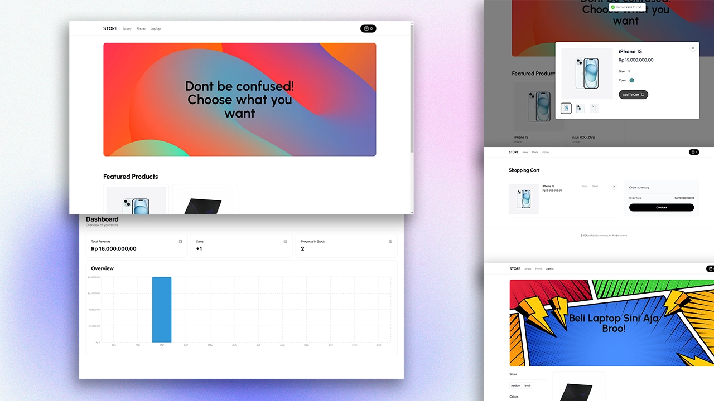

# E-Commerce + Dashboard & CMS: Create my first Full Stack Website for my personal E-commerce web

</div>





Untuk DEMO, gunakan [Stripe Testing Cards](https://stripe.com/docs/testing)


Ini adalah repositori untuk Website  Full Stack E-Commerce + Dasbor & CMS: Next.js 13 App Router, React, Tailwind, Prisma, MySQL

🛠️ Key Features:

<br />
✅Kami akan menggunakan Shadcn UI untuk Admin!
<br />
✅Dasbor admin kami akan berfungsi sebagai CMS, Admin, dan API!
<br />
✅Anda akan dapat mengendalikan beberapa vendor/toko melalui CMS tunggal ini! (Misalnya, Anda dapat memiliki "Toko Sepatu" dan ✅"Toko Laptop" dan "Toko Jas", dan CMS kami akan menghasilkan rute API untuk masing-masing secara individual!)
<br />
✅Anda akan dapat membuat, memperbarui, dan menghapus kategori!
<br />
✅Anda akan dapat membuat, memperbarui, dan menghapus produk!
<br />
✅Anda akan dapat mengunggah beberapa gambar untuk produk, dan mengubahnya kapan pun Anda mau!
<br />
✅Anda akan dapat membuat, memperbarui, dan menghapus filter seperti "Warna" dan "Ukuran", dan kemudian mencocokkannya dalam ✅formulir pembuatan "Produk".
<br />
✅Anda akan dapat membuat, memperbarui, dan menghapus "Billboard" yang merupakan teks besar di bagian atas halaman. Anda akan dapat melampirkannya ke satu kategori saja, atau menggunakan mereka secara independen (Admin kami menghasilkan API untuk semua kasus tersebut!)
<br />
✅Anda akan dapat mencari melalui semua kategori, produk, ukuran, warna, billboard dengan penomoran halaman yang disertakan!
<br />
✅Anda akan dapat mengendalikan produk mana yang "unggulan" sehingga mereka muncul di beranda!
<br />
✅Anda akan dapat melihat pesanan, penjualan, dll.
<br />
✅Anda akan dapat melihat grafik pendapatan Anda dll.
<br />
✅Anda akan mempelajari Otentikasi Clerk!
<br />
✅Pembuatan pesanan
<br />
✅Checkout Stripe
<br />
✅Webhook Stripe
<br />
✅MySQL + Prisma + PlanetScale


## 📙 Panduan Penggunaan 📙

### Prerequisites

**Node version 14.x**

### Cloning the repository

```shell
git clone https://github.com/syafiqurohman/ecom-dashboard.git
```

### Install packages

```shell
npm i
```

### Setup .env file


```js
NEXT_PUBLIC_CLERK_PUBLISHABLE_KEY=
CLERK_SECRET_KEY=
NEXT_PUBLIC_CLERK_SIGN_IN_URL=/sign-in
NEXT_PUBLIC_CLERK_SIGN_UP_URL=/sign-up
NEXT_PUBLIC_CLERK_AFTER_SIGN_IN_URL=/
NEXT_PUBLIC_CLERK_AFTER_SIGN_UP_URL=/

# This was inserted by `prisma init`:
# Environment variables declared in this file are automatically made available to Prisma.
# See the documentation for more detail: https://pris.ly/d/prisma-schema#accessing-environment-variables-from-the-schema

# Prisma supports the native connection string format for PostgreSQL, MySQL, SQLite, SQL Server, MongoDB and CockroachDB.
# See the documentation for all the connection string options: https://pris.ly/d/connection-strings

DATABASE_URL=''
NEXT_PUBLIC_CLOUDINARY_CLOUD_NAME=""
STRIPE_API_KEY=
FRONTEND_STORE_URL=http://localhost:3001
STRIPE_WEBHOOK_SECRET=
```

### Connect to PlanetScale and Push Prisma
```shell
npx prisma generate
npx prisma db push
```


### Start the app

```shell
npm run dev
```

## Available commands

Running commands with npm `npm run [command]`

| command         | description                              |
| :-------------- | :--------------------------------------- |
| `dev`           | Starts a development instance of the app |


## Authors

- [ooucholive](https://instagram.com/livgraph)
